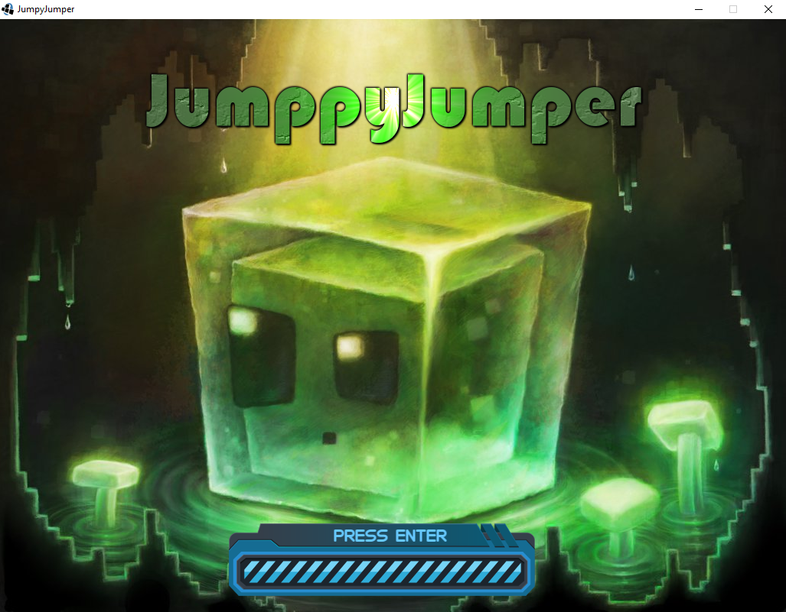

# JumppyJumper

JumpyJumper is a java game i created during a free project class at Beijing Jiaotong University.

I have used:
- Slick2d : Java 2D rendering library
- sprites and music from internet

My goal for this project was to improve my physics/collision system which i used for different games.
I have done everything from scratch in Java without external libraries (except Slick2D which create the window and renders the  sprites).

It is actually in alpha. It still got some bug, and only 1 level is available.

-------------------------------------------------------------------------------------------  
## Story :  

A factory has captured whild happy slimes in order to do chemistry test on them.

As the god of the slimes world, you need to use your power to open a way through the factory to free them.

-------------------------------------------------------------------------------------------  
## GamePlay :  

###### Actions
- The slimes will move straight without ever stop
- The player has to place portails to help the slimes for dodging the traps
- The camera will always follow the first slime, take care to don't loose the one who get stuck

###### Portals
- The player can place 2 types of portal : propule and repulse
- Propulse : yellow portail, when the slime will touch it, it will be propulsed in its direction (according the angle of the portal)
- Repulse : blue portail, when the slime will touch it, it will be propulsed in the opposite direction

 

- Samples

- The goald is to reach a gate at the end of the level and to free the slimes

